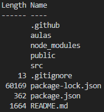

# Anotações

### package.json

* chave _main_
    * arquivo pricipal do projeto

    * Exemplo
        ```json
        {
            ...,
            "main": "index.html",
            ...
        }
        ```

### Nodemon

* Pacote serve para reiniciar a aplicação automaticamente quando um aqruivo é alterado.

* Mais sobre Nodemon: [CLIQUE AQUI](https://www.npmjs.com/package/nodemon)

* Exemplo 
    ```json
    {
        "name": "maratona-discover-2",
        "version": "1.0.0",
        "description": "Freelance Calculator",
        "main": "src/server.js",
        "scripts": {
            "dev": "nodemon ."
        },
        "keywords": [],
        "author": "",
        "license": "MIT",
        "dependencies": {
            "express": "^4.17.1"
        },
        "devDependencies": {
            "nodemon": "^2.0.7"
        }
    }
    ```

    * OBS: "." faz referência a chave _main_, ou seja, "src/server.js".

### Rotas relativas

* "./"
    * Voltar um diretório do arquivo em questão
    * 

* "../" 
    * Voltar para o diretório principal do projeto

### Atalhos

* Hard refresh no Chrome = CONTROL + SHIFT + R
        